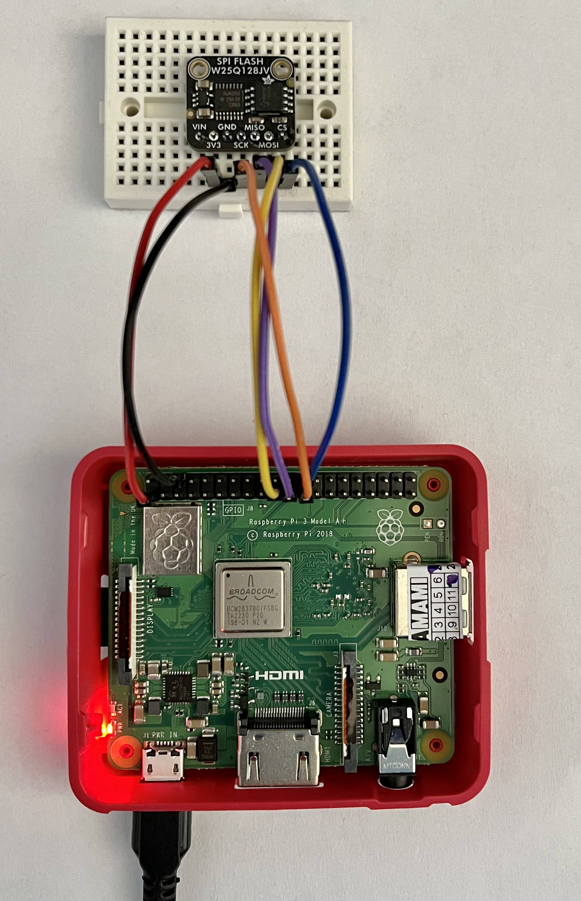

# Block driver for W25Q128JV flash
This repository contains my Linux kernel driver for W25Q128JV flash memory.
 
Overview:
* Uses SPI interface
* Based on the `blk-mq` kernel API
* Device Tree support
* Exposed to userspace as `/dev/w25q128jv`

## Demo

 

## Using the driver
Following steps show how to build and use the driver on target system, RPi 3A+ has been used as an example:
* Run `make` in the cloned repository to build the kernel module
* Build device tree overlay: `dtc -@ -I dts -O dtb -o device_overlay.dtbo dt/pi3a.dts`
* Load the overlay: `sudo dtoverlay device_overlay.dtbo`
* Load the module: `sudo insmod w25q128jv.ko`
* Create a filesystem on the drive (FAT16): `sudo mkfs.vfat -F 16 /dev/w25q128jv`
* Mount the formatted drive: `sudo mount /dev/w25q128jv /mnt`

Required packages: `linux-headers`, `build-essential`, `device-tree-compiler`